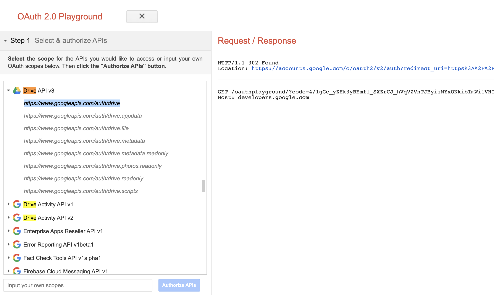
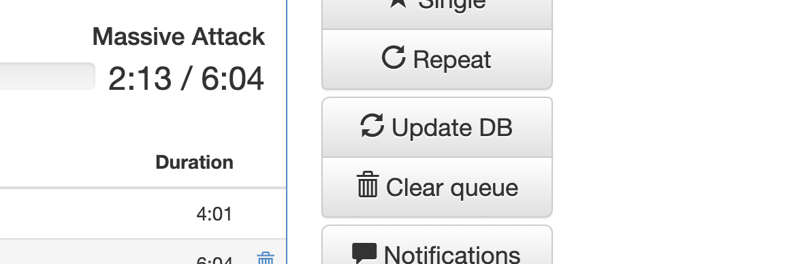

# PACIFICO.CLUB RADIO


Este proyecto levanta una radio en un Raspberri Pi 3 usando balena.io para orquestrar 5 servicios en un docker-compose.
- icecast (el que hace el stream) https://icecast.org/
- mpd (el que toca las canciones) https://wiki.archlinux.org/index.php/Music_Player_Daemon
- proxy (el balanceador que sale por el puerto 80) http://www.haproxy.org/
- sima (el dj) https://kaliko.me/mpd-sima/
- ympd (la intefaz visual) https://www.ympd.org/

## Que hacer si quiero pasar música a Pacifico.club
1. debes obtener un token de google drive desde google. Ingresa en esta web https://developers.google.com/oauthplayground, selecciona select & authorize apis > Drive API v3 > https://www.googleapis.com/auth/drive > click en AUTHORIZE API, luego debes elegir con cual perfil seguir. Cualquiera sirve ;)


2. Luego en el step 2 hacer click en el boton “Exchange authorization code for token”, y en la respuesta de la derecha copiar el valor de access_token, este lo usaremos como token para conectarnos con gdrive


3. Con el token ya puedes acceder al dashboard de balena y seleccionar el unico device bajo la app pacifico-club, deberas buscar el terminal al costado inferior derecho y seleccionar mpd para abrir sesion


4. Para pasar música desde el drive debes navegar a la carpeta donde lee la música el MPD, y luego debes correr estos comandos remplazando el access token
```
cd /lib/var/mpd/music

/usr/local/bin/gdrive download --recursive —skip 1_YUKtv3d2esPk2R_2iUYK1TBkH_Q52vg --access-token ya29.a0AfH6SMBM……
```

5. Desde YMPD (http://ympd.8151fa637af0a1247e7e55337f53e140.balena-devices.com) se debe clickear UPDATE DB y luego play a algún tema, así veras los temas desde ympd



## ¿Que hacer si YMPD no se puede conectar MPD
Debes reiniciar MPD desde balena.io

## ¿Que pasa si todo falla?
Revisar la conección de internet, si todo falla se puede crear una instancia desde 0 (ver abajo)

## Crear un nuevo device en balena
crear carpetas en mpd
```
mkdir -p /var/lib/mpd/playlists && mkdir -p /var/lib/mpd/database
```
darles los permisos necesarios
```
chmod g+w /var/lib/mpd/music /var/lib/mpd/playlists /var/lib/mpd/database
```
bajar gdrive
```
wget https://github.com/gdrive-org/gdrive/releases/download/2.1.0/gdrive-linux-rpi
```
copiar gdrive
```
cp gdrive-linux-rpi /usr/local/bin/gdrive;
```
darle permisos a gdrive
```
chmod a+x /usr/local/bin/gdrive;
```
descargar catalogo
```
/usr/local/bin/gdrive download --recursive —skip 1_YUKtv3d2esPk2R_2iUYK1TBkH_Q52vg --access-token ya29.a0AfH6SMBMNiqjtIKpwylJURALc5d06VJqM-hABxQIANFDpV6_4qgReE0-6LblT44Wlz5-nuEVN42AOT-fFAPmgFho4ZrGWZkpUF0A_r4boDk6d-SDSH2dAlGlwhVt1Pu7UgrY8aTgKB4befiC9NElIwwTB7KUMUT-6mM
````

## Creditos
Este proyecto es mantenido por Nicolas Justiniano (n.justiniano@gmail.com)

